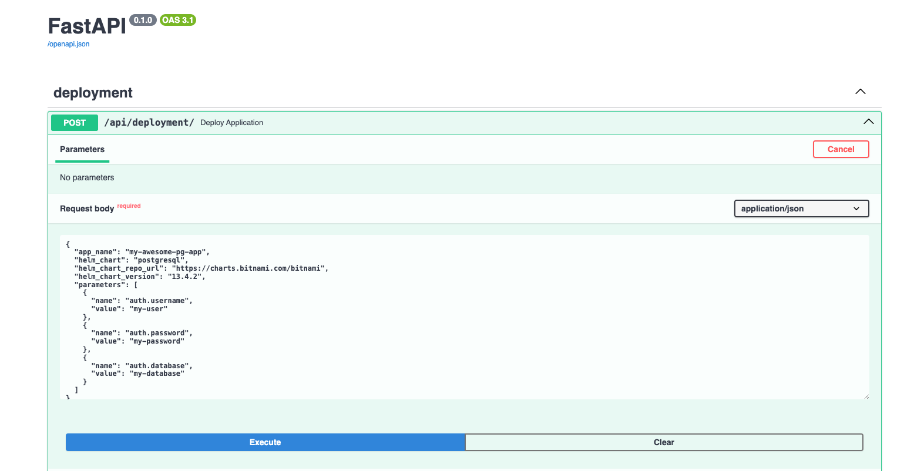
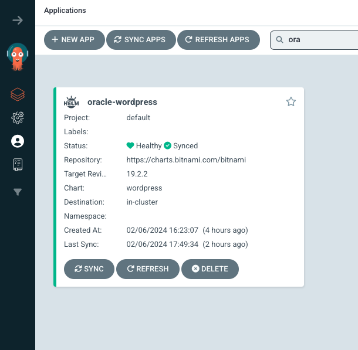
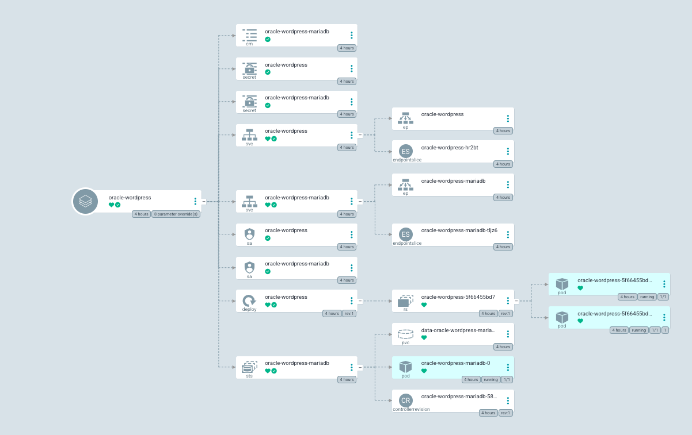

## GitOps with ArgoCD

## Introduction

This tutorial demonstrates deploying a WordPress application to a Kubernetes cluster using ArgoCD. WordPress, a popular open-source content management system from Bitnami's artifact registry, is deployed using a Helm chart . The deployment is managed through ArgoCD, enabling automated, reliable, and maintainable application management in Kubernetes.  We aim to test out deployment using Helm Chart and Fast API application Interface.


## Helm Chart Deployment 

### Prerequisites

- **Minikube**: A local Kubernetes cluster.
- **kubectl**: A command-line tool for interacting with the Kubernetes cluster.
- **Helm**: A package manager for Kubernetes.
- **ArgoCD**: A Kubernetes-native continuous delivery system.

## Step-by-Step Deployment Process

### Step 1: Set Up Minikube and Kubectl

Start by setting up a local Kubernetes cluster using Minikube.

1. **Install Minikube**: Follow the official guide to install Minikube https://minikube.sigs.k8s.io/docs/start/  on your system.
2. **Start Minikube**: Run `minikube start` to initiate the cluster
3. **Install Kubectl**: By default, kubectl gets configured to access the kubernetes cluster control plane inside minikube when the `minikube start` command is executed


### Step 3: Install Helm

1. **Install Helm**: Use Homebrew by running 

```bash
brew install helm
```
2. **Verify Installation**: Ensure Helm is correctly installed by running 

```bash
helm version.
```
### Step 4: Install ArgoCD Using Helm

1. **Add ArgoCD Repository**: Run 

```bash
helm repo add argo https://argoproj.github.io/argo-helm
```

2. **Install ArgoCD**: To install ArgoCD on your Kubernetes cluster, Execute

```bash
helm install argocd argo-cd/argo-cd
```
### Step 5: Expose ArgoCD Service

1. **Expose the ArgoCD API Server**: Run 

```bash
kubectl patch svc argocd-server -p '{"spec": {"type": "LoadBalancer"}}'
```
2. **Access ArgoCD UI**: Visit the external IP to see ArgoCD's UI.

### Step 6: Retrieve ArgoCD Admin Password

1. **Fetch ArgoCD Password**: Execute

```bash
kubectl get secret argocd-initial-admin-secret -o jsonpath="{.data.password}" | base64 -d; echo
```
### Step 7: Connect ArgoCD to Your Git Repository

1. **Set Up Git Integration**: In ArgoCD, connect to your Git repository where the Kubernetes manifests or Helm charts are stored.

### Step 8: Set Up ArgoCD as an App of Apps

1. **App of Apps**: This method involves creating a parent application in ArgoCD that manages other applications. It allows for organizing and managing multiple applications systematically.

### Step 9: Deploy WordPress Using ArgoCD

1. **Prepare WordPress Manifest**: Use the provided manifest to define the WordPress application in ArgoCD.
2. **Create Application in ArgoCD**: Include details like application name, project name, sync policy, repository URL, revision, path, cluster URL, and namespace.
3. **Deploy the Application**: ArgoCD will deploy the WordPress application based on the defined manifest.

### Step 10: Access WordPress

1. **Port Forward**: To access WordPress, run 

```bash
kubectl port-forward svc/wordpress-app -n wordpress 3000:80
```
2. **Visit WordPress**: Open a browser and go to `http://localhost:3000` to access your WordPress site.


## Fast API Application Interface

Using the [Fast API](https://argocd-api-htgvvmv22a-ew.a.run.app/docs#/deployment/deploy_application_api_deployment__post) app interface, we followed the JSON schema provided



Made edits to fit the resources we provided in the helm file, clicked the execute button our application was deployed on argoCD





To access our application we used the loadbalancer public IP (which you would find in the service resourse for the app) and specified the port

## Conclusion

This guide demonstrated deploying a WordPress application on a Kubernetes cluster using a helm chart and an API request with ArgoCD. This method offers an efficient and scalable way to manage applications in Kubernetes, utilizing the power of GitOps and declarative configuration. By following these steps, you can deploy and manage your applications reliably on Kubernetes.