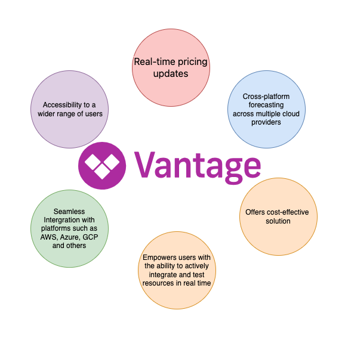
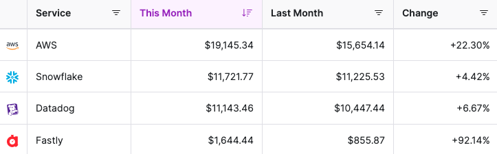

# FinOps with Vantage

## Introduction

When it comes to managing cloud costs, the choices are vast, but finding the right one can be like looking for a needle in a haystack. We've all been there – you launch a cloud service, and before you know it, there's a confusing bill waiting for you. Discovering there are tools designed to demystify these costs is a huge relief. 
Although there’s a ton of cloud cost management tools, Vantage Cloud emerges as a fresh and exciting discovery. Unlike others, it’s not only user friendly but also delivers efficiency in managing cloud resources. Let's take a closer look at Vantage Cloud and uncover why it stands out in the ocean of similar tools.

## About Vantage
Vantage is a cloud cost transparency platform that gives developers the tools they need to analyse, report on and optimise Cloud and K8s services. Their goal is to simplify the demystification of cloud infrastructure bills.

Some of it’s capabilities include;

- Resource Optimization: Vantage Cloud's systematically evaluates your cloud infrastructure to identify areas where resources are underutilized or overprovisioned. By analyzing usage patterns and workload requirements, it suggests scaling down unnecessary resources or reallocating them more effectively. This reduces wastage, leading to a more eco-friendly cloud footprint. Additionally, it offers automation options to implement these suggestions, making resource optimization both timely and hassle-free.

- Advanced AWS Integration: Vantage Cloud takes AWS management to the next level, surpassing the utility of AWS's own Cost Explorer. It provides per-resource cost details for every service, complete with Amazon Resource Names (ARNs). 

- Efficient Pricing and Cost Forecasting: Its real-time pricing capability quickly calculates costs post-deployment. Notably effective during a Kubernetes (K8s) cluster deployment I made, where it not only detailed the immediate costs but also projected a forecasted bill over a specified period. This predictive capability enables users to plan their finances better and avoid unforeseen expenses.

- Broad Cloud Provider Support: Vantage Cloud extends its capabilities beyond AWS to other major cloud providers like Microsoft Azure, Google Cloud Platform, and Oracle Cloud. This multi-cloud support is vital for organizations utilizing a combination of cloud services. Vantage Cloud integrates seamlessly with these platforms, providing a unified interface for managing resources across different clouds. 

- Comprehensive Reporting and Analytics: The tool generates detailed reports that cover a wide range of metrics, including cost trends, resource utilization, and efficiency metrics. These reports offer actionable insights, helping users understand how their cloud resources are being used and where there are opportunities for cost savings or performance improvements. 

- Enhanced Access Management: Vantage Cloud eliminates the need to add engineers to the AWS Console Billing account. This streamlines access management, enhancing security and simplifying administrative workflows.

<i> Additionally, Vantage Cloud provides customizable dashboards, enabling users to focus on the metrics that matter most to their business. The analytics also incorporate historical data, offering a longitudinal view of cloud usage and expenses, which is crucial for trend analysis and future planning.</i>

In comparison to other tools, Vantage offers;

## Justifications for Choosing Vantage 

-  Cost-Effectiveness: 

   Vantage Cloud's precision in pricing and cost optimization is a major factor, the tool goes beyond basic cost tracking; it actively suggests ways to reduce unnecessary expenditure. For instance, during the deployment of a Kubernetes (K8s) cluster, I noticed how Vantage Cloud identified and recommended adjustments for underutilized resources. This level of detail ensured that I was not spending more than necessary. By optimizing cloud resource usage, Vantage Cloud effectively reduces wastage and maximizes the value of every dollar spent on cloud services. This is especially crucial for businesses where cloud costs form a significant portion of operational expenses.

- Time-Saving: 
   Vantage Cloud’s quick deployment capability and real-time data updates are significant time-savers. When I deployed the K8s cluster, I was impressed by how swiftly Vantage Cloud provided cost information and resource utilization data. This rapid feedback loop allows for immediate adjustments, saving hours that would otherwise be spent in manual monitoring and calculations. By streamlining these processes, Vantage Cloud frees up time, enabling users to concentrate on core business functions rather than getting bogged down by cloud management complexities.

 - Strategic Financial Planning: 

   The forecasted billing feature of Vantage Cloud is great for strategic financial planning. It's not just about knowing what you've spent; it's about understanding future financial commitments. Vantage Cloud offers a clear view of future expenses based on current usage patterns, which was particularly evident when I monitored the projected costs for the K8s cluster over different time frames. This foresight is invaluable for budgeting and financial planning, allowing businesses to allocate funds more effectively and avoid unexpected costs.

-  Cross-Platform Compatibility: 

   In today's cloud-centric world, many businesses operate in multi-cloud environments, and Vantage Cloud's cross-platform compatibility makes it an indispensable tool. Whether it's AWS, Azure, Google Cloud, or any other major cloud provider, Vantage Cloud seamlessly integrates with these platforms. This was evident in the ease with which I could manage and analyze the K8s cluster deployed on AWS while considering resources on other platforms. This compatibility ensures that businesses can have a unified view and control of their cloud resources, irrespective of the cloud service provider, simplifying management and enhancing efficiency across diverse cloud environments.

   ## Conclusion 
<i>The combination of cost-effectiveness, time-saving features, strategic financial planning capabilities, and cross-platform compatibility make Vantage Cloud an essential tool for modern cloud management. My experience deploying a Kubernetes cluster using Vantage Cloud is a testament to its effectiveness and efficiency, making it a highly recommended choice for anyone looking to optimize their cloud operations.</i>