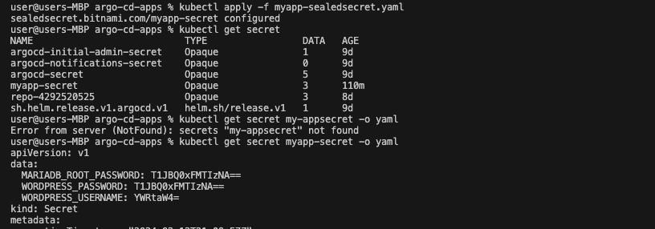

## Automate Secret Encryption on Kubernetes

This document outlines a process for securely managing secrets in Kubernetes using automated encryption. The approach involves removing plain-text secrets from Helm charts, storing them in a .env file, and then encrypting them into Sealed Secrets which can be safely stored in version control.

## Prerequisites
- Kubernetes Cluster: Kubernetes cluster for wordpress-app.
- .env file: Remove values from the Helm chart and place them in a .env file or a similar environment-specific configuration file.
- Sealed Secrets Controller: Install the Sealed Secrets controller in your Kubernetes cluster. This can typically be done manually or using a Helm chart itself.
- Kubeseal: Install kubeseal, a CLI tool that communicates with the Sealed Secrets controller.

## Steps
- Create a script that

  1. Convert your .env file into a Kubernetes Secret manifest dynamically.
  2. Pipe this manifest directly into kubeseal to seal the secret.
  3. Read each line in the .env file and base64 encode the values
  4. Split the lines into key and value
  5. Prints out sealed-secret file name
  
- Apply the sealed secret to your cluster using 

```bash
kubectl apply -f myapp-sealedsecret.yaml  
```


- When you apply this SealedSecret to your Kubernetes cluster, the Sealed Secrets Controller decrypts it and creates a regular Secret out of it. This decrypted Secret is what your application uses, and it looks just like your original secret.

Automating the encryption of secrets in Kubernetes using Sealed Secrets provides a secure method to manage sensitive configuration data. This process is particularly useful for;

- Security: In the case of this demo, The `myapp-sealedsecret` is encrypted and can only be decrypted by the Sealed Secrets Controller in the Kubernetes cluster. This makes it safe to store in a public repository or version control system.
- Best Practices: Storing encrypted secrets aligns with best practices in secret management for Kubernetes. It ensures that sensitive data is not exposed to unauthorized users.
- Workflow: The typical workflow involves generating your Kubernetes Secret (in base64), sealing it with kubeseal, and then applying the resulting Sealed Secret to your Kubernetes cluster. The Sealed Secrets Controller in the cluster will then decrypt it and create a regular Secret from it, which your applications can use.
- GitOps and CI/CD: In a GitOps or CI/CD setup, you would store only the Sealed Secrets in your repository. When you deploy to your cluster, the deployment process involves applying these Sealed Secrets, which are then automatically decrypted.

## Conclusion 
This setup helps to securely manage secrets in Kubernetes, especially in a GitOps workflow where code and configuration are stored in version control systems.